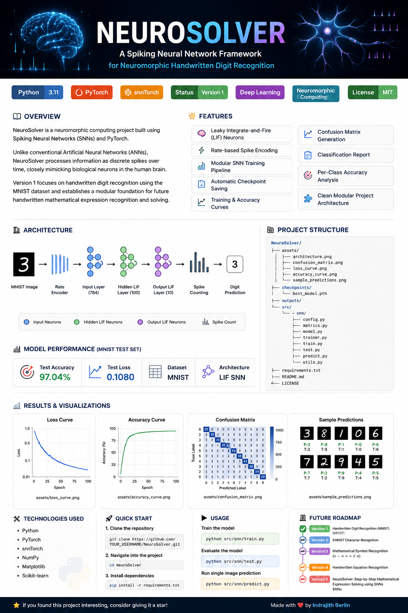
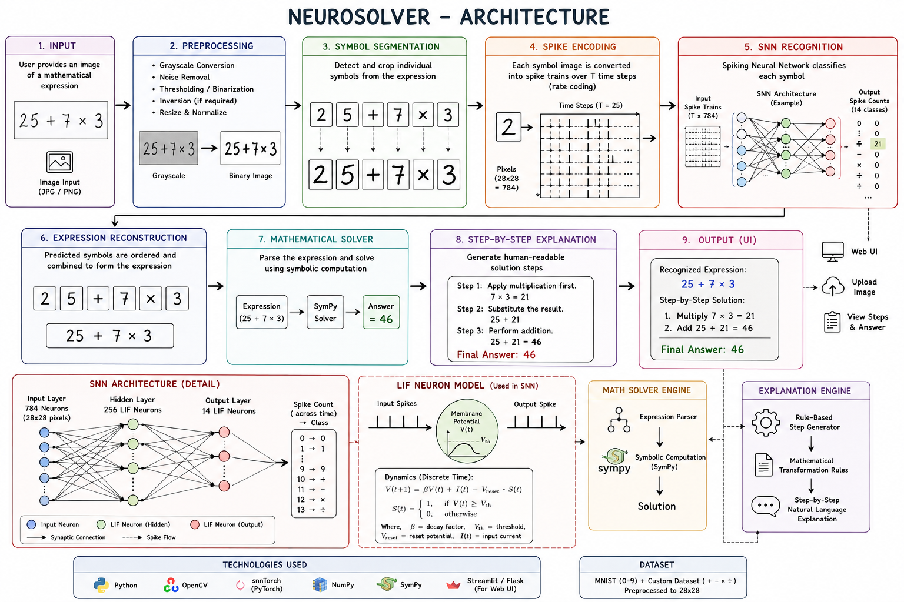
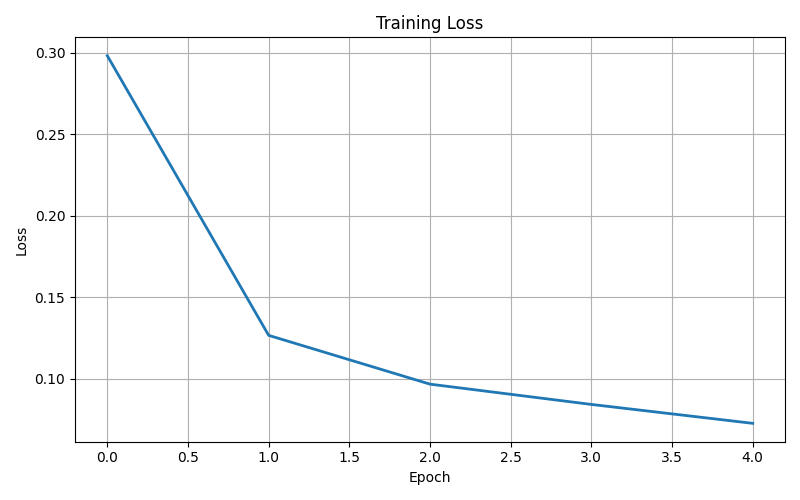
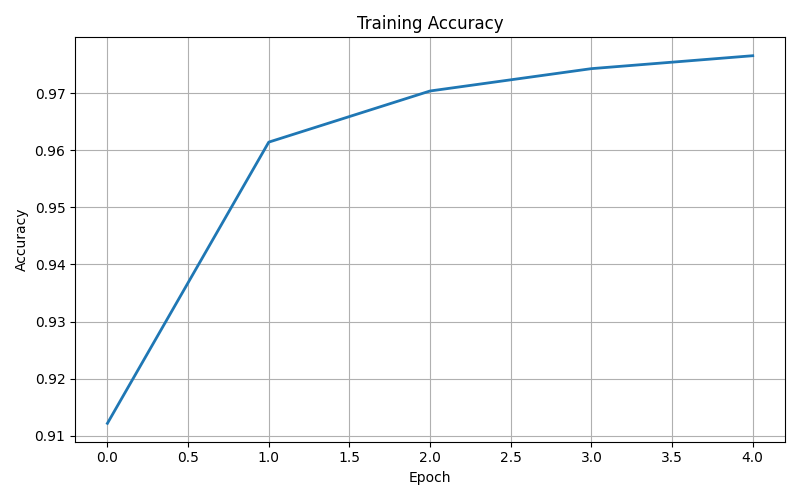
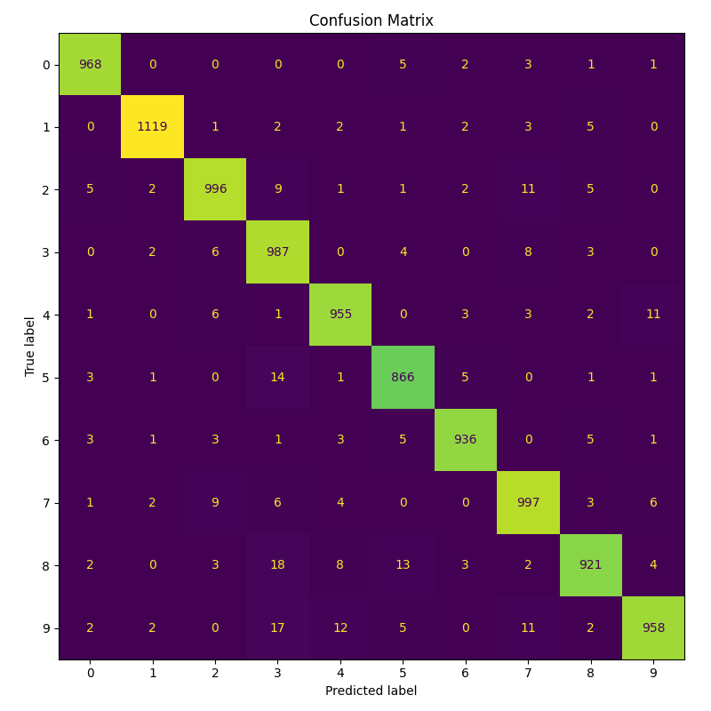
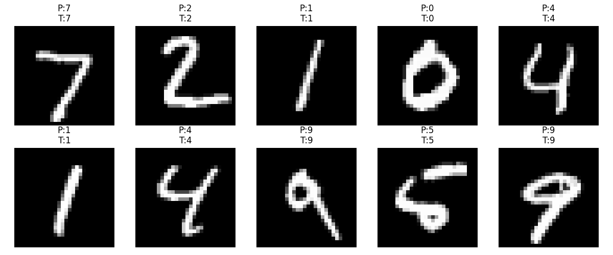

<p align="center">
  
</p>

<h1 align="center">🧠 NeuroSolver</h1>

<p align="center">
  <strong>Foundations: A Modular Spiking Neural Network Framework for Neuromorphic Computing</strong>
</p>

<p align="center">
  Building biologically inspired AI using <strong>Spiking Neural Networks (SNNs)</strong>, <strong>PyTorch</strong>, and <strong>snnTorch</strong>.
</p>

<p align="center">
  
  
  
  
  
  
</p>

---

# 📖 Why NeuroSolver ?

**NeuroSolver** is a research-oriented project exploring **Neuromorphic Computing** through **Spiking Neural Networks (SNNs)**.

Unlike conventional Artificial Neural Networks (ANNs), SNNs process information as **discrete spikes over time**, closely mimicking the communication mechanism of biological neurons. This paradigm enables more biologically plausible and potentially energy-efficient AI models.

**Version 1 (Foundations)** focuses on handwritten digit recognition using the **MNIST** dataset and establishes a modular software framework that serves as the foundation for future versions of NeuroSolver.

The long-term vision is to build a neuromorphic AI capable of recognizing handwritten mathematical expressions and solving them step by step using Spiking Neural Networks.

---

# ✨ Features

- 🧠 Leaky Integrate-and-Fire (LIF) Neurons
- ⚡ Rate-Based Spike Encoding
- 📊 Modular Training Pipeline
- 💾 Automatic Model Checkpointing
- 📈 Training & Validation Curves
- 📉 Confusion Matrix Generation
- 📋 Classification Report
- 🎯 Per-Class Accuracy Analysis
- 🧩 Clean & Scalable Project Architecture

---

# 🏗️ Project Architecture

<p align="center">
    
</p>

**Workflow**

```
MNIST Image
      │
      ▼
Rate Encoder
      │
      ▼
Input Layer (784)
      │
      ▼
Hidden LIF Layer
      │
      ▼
Output LIF Layer
      │
      ▼
Spike Counting
      │
      ▼
Digit Prediction
```

---

# 📂 Project Structure

```text
NeuroSolver/

├── assets/
│   ├── banner.png
│   ├── architecture.png
│   ├── loss_curve.png
│   ├── accuracy_curve.png
│   ├── confusion_matrix.png
│   └── sample_predictions.png
│
├── checkpoints/
│   └── best_model.pth
│
├── src/
│   ├── encoding/
│   ├── neurons/
│   ├── snn/
│   ├── solver/
│   └── utils/
│
├── README.md
├── requirements.txt
├── LICENSE
└── .gitignore
```

---

# 📊 Model Performance

| Metric | Value |
|---------|------:|
| Dataset | MNIST |
| Test Accuracy | **97.04%** |
| Test Loss | **0.1080** |
| Classes | 10 |
| Architecture | LIF Spiking Neural Network |

---

# 📈 Training Loss

<p align="center">

</p>

---

# 📈 Training Accuracy

<p align="center">

</p>

---

# 📊 Confusion Matrix

<p align="center">

</p>

---

# 🔍 Sample Predictions

<p align="center">

</p>

---

# 🛠️ Technologies Used

| Category | Technologies |
|-----------|--------------|
| Language | Python |
| Deep Learning | PyTorch |
| Neuromorphic Framework | snnTorch |
| Numerical Computing | NumPy |
| Visualization | Matplotlib |
| Evaluation | Scikit-learn |

---

# 🚀 Installation

Clone the repository

```bash
git clone https://github.com/indrajithberlin/NeuroSolver.git
```

Navigate into the project

```bash
cd NeuroSolver
```

Install dependencies

```bash
pip install -r requirements.txt
```

---

# ▶️ Training

Train the model using:

```bash
python src/snn/train.py
```

The training pipeline automatically:

- Trains the network
- Saves the best model
- Generates loss and accuracy curves

---

# 🧪 Evaluation

Evaluate the trained model using:

```bash
python src/snn/test.py
```

The evaluation pipeline generates:

- Test Accuracy
- Test Loss
- Classification Report
- Per-Class Accuracy
- Confusion Matrix
- Sample Predictions

---

# 📌 Current Results

| Metric | Score |
|---------|------:|
| Accuracy | **97.04%** |
| Precision | **97%** |
| Recall | **97%** |
| F1-Score | **97%** |

---

# 🗺️ Project Roadmap

### ✅ Version 1 — Foundations

- Handwritten Digit Recognition
- LIF Neuron Implementation
- Spike Encoding
- Modular SNN Framework
- Training & Evaluation Pipeline
- Visualization Tools

---

### 🚧 Version 2

- EMNIST Character Recognition
- Improved SNN Architecture
- Hyperparameter Optimization

---

### 🚧 Version 3

- Mathematical Symbol Recognition

Examples:

```
+
-
×
÷
=
√
π
∫
```

---

### 🚧 Version 4

Handwritten Mathematical Expression Recognition

```
Image
   ↓
Character Detection
   ↓
Expression Parsing
   ↓
Structured Mathematical Expression
```

---

### 🚧 Version 5 — NeuroSolver

A complete neuromorphic AI capable of:

- Recognizing handwritten mathematical expressions
- Parsing equations
- Solving expressions step by step
- Exploring biologically inspired computation for symbolic reasoning

---

# 🎓 Learning Outcomes

This project demonstrates practical implementation of:

- Spiking Neural Networks (SNNs)
- Leaky Integrate-and-Fire (LIF) Neurons
- Rate Coding
- Backpropagation Through Time (BPTT)
- Neuromorphic Computing Concepts
- PyTorch Model Development
- Modular Software Engineering
- Deep Learning Evaluation Techniques

---

# 👨‍💻 Author

## Indrajith Berlin

**B.Tech Computer Science & Engineering (Artificial Intelligence & Machine Learning)**

### Areas of Interest

- Artificial Intelligence
- Neuromorphic Computing
- Deep Learning
- Computer Vision
- Machine Learning

**GitHub**

https://github.com/indrajithberlin

**LinkedIn**

https://www.linkedin.com/in/indrajith-berlin

---

# ⭐ Support

If you found this project interesting or useful, consider giving it a ⭐ on GitHub.

Your support motivates future development and helps others discover the project.

---

> **NeuroSolver is an evolving research project exploring biologically inspired intelligence through Spiking Neural Networks, with the long-term goal of recognizing and solving handwritten mathematical expressions using neuromorphic computing.**